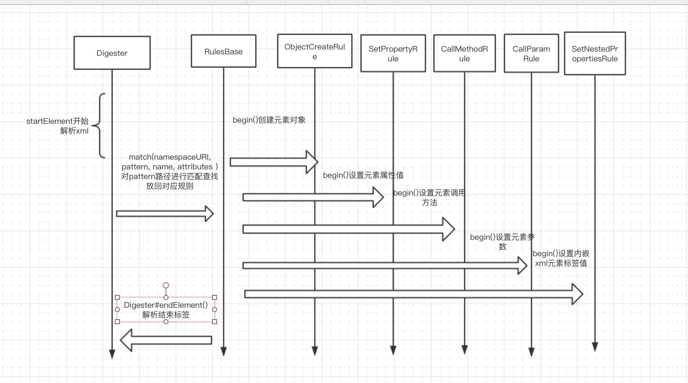

 #commons-digester3使用和介绍

## 1.环境

jdk11

pom文件引入包版本

```xml
<!--digester3 解析xml包引入-->
<dependency>
  <groupId>org.apache.commons</groupId>
  <artifactId>commons-digester3</artifactId>
  <version>3.2</version>
</dependency>
```

### 1.1介绍

在查阅tomcat源码中才了解到digester，digester是把xml文件解析成pojo对象，digester底层使用sax(Simple API for XML Parsing)方式来读取xml，本文暂不介绍sax

## 2.工程案例

代码片段，源码链接

```java
public class DigesterMain {

    public static void main(String[] args) {
        
        URL url =
                new Digester().getClassLoader().getResource("digester/example.xml");
        String filename = url.getFile();
        Digester d = new Digester();
        AddressBook book = new AddressBook();
        //把book放在栈顶
        d.push(book)
        //增加解析xml规则
        addRules(d);

        try {
            java.io.File srcfile = new java.io.File(filename);
            //解析文件
            d.parse(srcfile);
        } catch (java.io.IOException ioe) {
            System.out.println("Error reading input file:" + ioe.getMessage());
            System.exit(-1);
        } catch (org.xml.sax.SAXException se) {
            System.out.println("Error parsing input file:" + se.getMessage());
            System.exit(-1);
        }


        book.print();
    }

    private static void addRules(Digester d) {


        //增加创建对象规则 并添加
        d.addObjectCreate("address-book/person", Person.class);
        //设置属性规则
        d.addSetProperties("address-book/person");
       //当遇到结束标签时候经过层层递归到元素时候 调用该方法把值设置到上级 方法在接下标签开始时候不操作					//元素 在遇到结束标签才触发操作
        d.addSetNext("address-book/person", "addPerson");

        //设置该路径下 调用方法
        d.addCallMethod("address-book/person/name", "setName", 0);

        //设置该路径下 调用方法
        d.addCallMethod("address-book/person/email", "addEmail", 2);
        //设置该路径下 方法中参数
        d.addCallParam("address-book/person/email", 0, "type");
        //设置该路径下 方法中参数
        d.addCallParam("address-book/person/email", 1);

        //创建该路径下对象
        d.addObjectCreate("address-book/person/address", Address.class);

        d.addSetNext("address-book/person/address", "addAddress");
        d.addSetNestedProperties("address-book/person/address");
    }
}
```


Example.xml文件

```xml
<address-book>
  <person id="1" category="acquaintance">
    <name>Gonzo</name>
    <email type="business">gonzo@muppets.com</email>
    <address>
      <type>home</type>
      <street>123 Maine Ave.</street>
      <city>Las Vegas</city>
      <state>NV</state>
      <zip>01234</zip>
      <country>USA</country>
    </address>
  </person>
</address-book>
```

addressBook

```java
public class AddressBook
{

    private final LinkedList<Person> people = new LinkedList<Person>();

    public void addPerson( Person p )
    {
        people.addLast( p );
    }

    public void print()
    {
        System.out.println( "Address book has " + people.size() + " entries" );

        for (Person p : people) {
            p.print();
        }
    }

}
```

## 3.核心类流程图

### 3.1 使用digester类介绍

####3.1.1属性stack 保存xml中元素，不断把解析元素压入栈中，遇到解析结束标签出栈

#### 3.1.2属性rules保存处理元素规则

###3.2流程图


